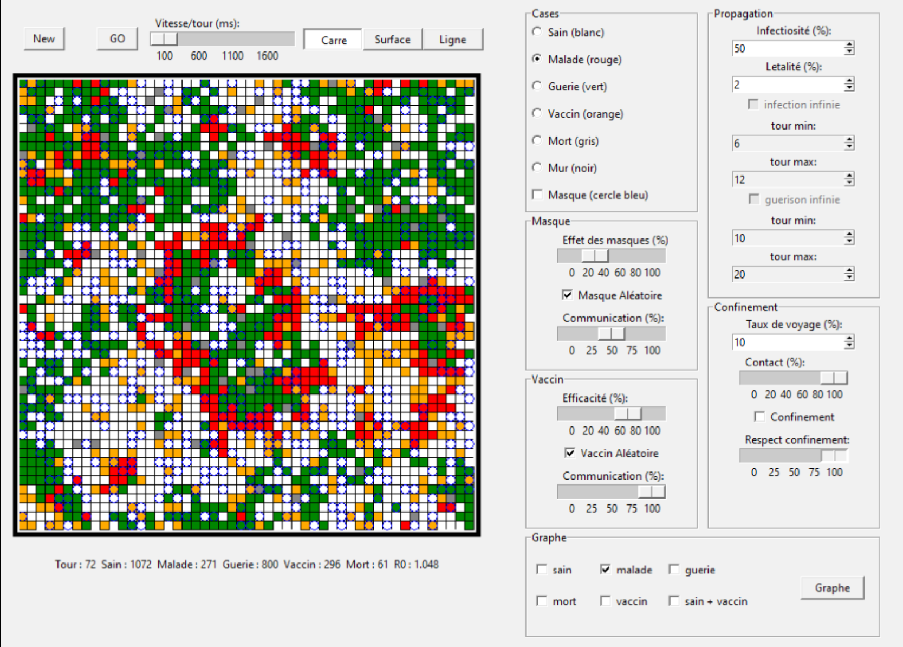

<div align="center">

# Epidemic Simulation - Cellular Automaton

This project is licensed under the Apache 2.0 License.

</div>

---

## **Project Overview**

The risk of a global epidemic is expected to increase over the coming decades. It is crucial to develop tools to anticipate and understand disease spread.

At the beginning of 2021, in the aftermath of the global pandemic, this project was created to simulate the spread of a virus using a cellular automaton approach, inspired by Conway's Game of Life. While not a precise predictive model, this simulation provides a visually insightful representation of epidemic waves.

In the simulation:

- **White cells** represent healthy individuals.
- **Red cells** are infected individuals.
- **Green cells** are recovered individuals.
- **Gray cells** represent deceased individuals.
- Additional elements include masks, lockdown measures, and vaccines (yellow cells).

By adjusting parameters, realistic epidemic behaviors can be reproduced, including the impact of masks, lockdowns, and vaccination strategies.

The repository contains:

- The source code for the simulation, available in the `src` folder.

- A `requirements.txt` file for dependency installation.

---

[Installation and Execution](#installation) •
[Contributions](#contributions)


## Features

- **Cellular Automaton-Based Simulation**: Each cell represents an individual whose state evolves over time based on interactions with neighboring cells.

- **Configurable Epidemic Parameters**: Modify infection rates, recovery times, and mortality probabilities.

- **Intervention Strategies**: Simulate the effects of masks, lockdowns, and vaccinations on epidemic dynamics.

- **Visual Representation**: The simulation provides a clear graphical representation using tkinter.

## Table of Contents

- [Installation](#installation)
  - [Pre-requisites](#pre-requisites)
  - [Compilation](#compilation)
- [Usage](#usage)
- [Contributions](#contributions)
  - [Authors](#authors)
  - [License](#license)


# Installation

[(Back to top)](#table-of-contents)

## Pre-requisites

Ensure you have Python installed on your system.

## Setup

Clone the repository and install dependencies:

```bash
git clone https://github.com/your-username/epidemic-simulation.git
cd epidemic-simulation
pip install -r requirements.txt
```

# Usage

[(Back to top)](#table-of-contents)

Run the simulation using:

```bash
python src/main.py
```

This will launch the `tkinter` interface, where you can adjust parameters and observe the simulation in real time.

 

*Program Interface*

# Contributions
<sup>[(Back to top)](#table-of-contents)</sup>

## Authors

- [**Remi Jorge**](https://github.com/RemiJorge)

## License

This project is licensed under the Apache 2.0 License - see the [LICENSE](LICENSE) file for details.

